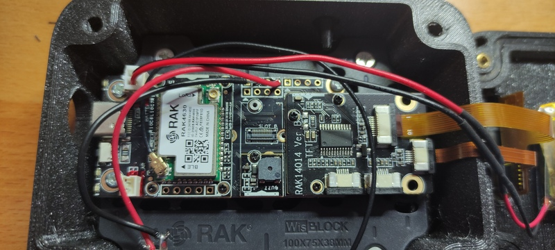

# WisBlock Smart Cube Companion

This repository holds the code for the WisBlock Smart Cube Companion. A BLE device to be used with Smart Magic Cubes like GAN 356 i3, GoCube, Giiker and Xiaomi cubes, that also suppoprts Stackmat connection or good old fingertip start/stop.

## Features

* Support for GAN, Giiker i3, Giiker i2 and GoCube smart cubes (tested with GAN 356 i3, original Giiker cubes and GoCubeX cube)
* Support for StackMat
* Support for manual interface (swipe to move from menu to menu, tap to start/stop timer)
* Cube actions
    * 4U to go to scramble page, 4U again to start inspect without scrambling
    * Any movement after solving the cube to see stats
* Stores statistics for 4 different users (PB, Ao5, Ao12 and last 12 individual solves) and 6 different puzzles (3x3x3, 2x2x2, Pyraminx, Skweb, Megaminx and Megaminx2)
* Reset user/puzzle stats (long tap on the screen while at the user's stat page)
* Colorful interface
* Touchscreen for user interaction
* Visual representation of the cube state in 2D and 3D (only for smart cubes)
* 20 movements scramble generation (9 movements for 2x2x2) following WCA rules
* Automatic start/stop timer for smart cubes
* Built-in LiPo battery for several hours of usage

## Required hardware

These are the components required for this project:

* [RAK19007 WisBlock Base Board 2nd Gen](https://store.rakwireless.com/products/rak19007-wisblock-base-board-2nd-gen)
* [RAK4631 Nordic nRF52840 BLE Core](https://store.rakwireless.com/products/rak4631-lpwan-node)
* [RAK14014 230x320 Full Color TFT Display](https://store.rakwireless.com/products/240x320-pixel-full-color-tft-display-with-touch-screen-rak14014)
* [RAK18001 Buzzer module](https://store.rakwireless.com/products/wisblock-buzzer-module-rak18001)
* Custom 3D printed enclosure (soon available for purchase)
* Small LiPo battery (I'm using a 1000 mAh nominal)

The whole list is between $60 and $70 at the moment (but you should also consider shipping and customs costs). On top of that you will need a smart cube if you want to use the smart cube link. Mind right now it only supports GAN, GoCube and Giiker/Xiami cubes like these ones (these are affiliate links):

* [GAN 356 i3 3x3 Magnetic Magic Cube](https://s.click.aliexpress.com/e/_DejEzdL)
* [GAN i3 Carry Smart Magic Cube](https://s.click.aliexpress.com/e/_DeeLuhR)
* [Giiker Electronic Bluetooth Smart Cube](https://s.click.aliexpress.com/e/_Dm1GTOV)
* [Giiker i2 Smart Cube](https://s.click.aliexpress.com/e/_Dc6QohF)
* [XiaoMi Bluetooth Magic Cube](https://s.click.aliexpress.com/e/_DFSlXJR)

Or you can use a StackMat like the [QiYi Timer Magic Cube Speed Timer](https://s.click.aliexpress.com/e/_DlMhpDL) (also affiliate link) with a regular cube.

## Connecting the hardware

There is very little complexity in the setup. Read about the [WisBlock platform](https://docs.rakwireless.com/Product-Categories/WisBlock/RAK19007/Datasheet) to know more. You only need to know that the code expects the buzzer to be on slot A and the audio jack is connected to the secondary hardware serial in the J10 header. This is optional, of course, but it will require some soldering if you want support for a StackMat. 

## Building the firmware

The firmware has been prepared to be compiled using PlatformIO (https://platformio.org/), but the WisBlock RAK4631 is not yet supported by default so you will first have to add support for it manually after installing PlatformIO. You can follow the instructions to do so here: https://github.com/RAKWireless/WisBlock/tree/master/PlatformIO.

Once PlatformIO and RAK4631 support installed you will only have to build the firmware (from the VSCore extension or using the command line: `pio run`).

To flash the WisBock connect it to your computer and select build & flash on the IDE or type `pio run -t upload` on the command line.

## Gallery

A small gallery to know more about the project.

## License

Copyright (C) 2023 by Xose Pérez (@xoseperez)

This program is free software: you can redistribute it and/or modify
it under the terms of the GNU General Public License as published by
the Free Software Foundation, either version 3 of the License, or
(at your option) any later version.

This program is distributed in the hope that it will be useful,
but WITHOUT ANY WARRANTY; without even the implied warranty of
MERCHANTABILITY or FITNESS FOR A PARTICULAR PURPOSE.  See the
GNU General Public License for more details.

You should have received a copy of the GNU General Public License
along with this program.  If not, see <http://www.gnu.org/licenses/>.
